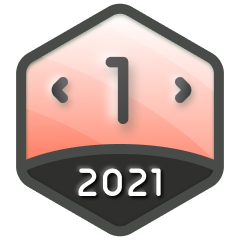
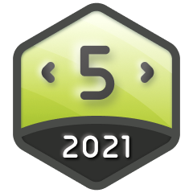
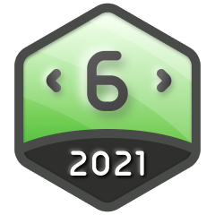
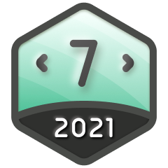
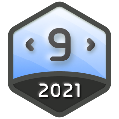
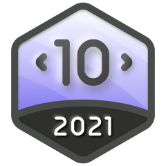
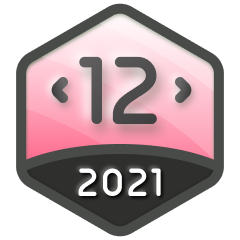
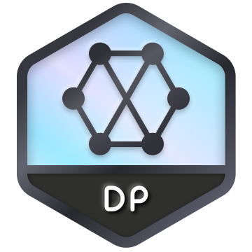
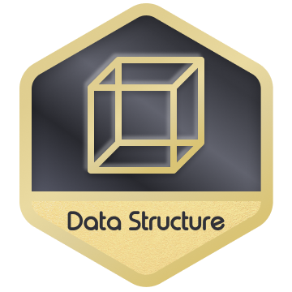

# LeetCode Badges

This section will showcase all the badges earned on LeetCode. Each badge represents a milestone in the journey of problem-solving and mastering algorithms. You can track progress and achievements in various categories such as difficulty levels, problem-solving consistency, and community contributions.

_Special thanks to [LeetCode-Badges](https://github.com/ChinemeremChigbo/LeetCode-Badges) by [Chinemerem](https://github.com/ChinemeremChigbo) for publish the badges and making it possible to include them here._

 

<table>
  <tr>
    <th>Badge</th>
    <th>Name</th>
    <th>How to Earn</th>
    <th>Type</th>
    <th>Earnable</th>
  </tr>
  <tr>
    <td align="center"></td>
    <td align="center">Guardian</td>
    <td align="center">Have a Contest Rating >=1600 and finish in the top 5% of a contest</td>
    <td align="center">Competition Medals</td>
    <td align="center">✅</td>
  </tr>
  <tr>
    <td align="center"></td>
    <td align="center">Knight</td>
    <td align="center">Have a Contest Rating >=1600 and finish in the top 25% of a contest</td>
    <td align="center">Competition Medals</td>
    <td align="center">✅</td>
  </tr>
  <tr>
    <td align="center"></td>
    <td align="center">Apr 2025 Badge</td>
    <td align="center">Submit code daily in April 2025</td>
    <td align="center">Daily Medals</td>
    <td align="center">✅</td>
  </tr>
  <tr>
    <td align="center"></td>
    <td align="center">Introduction to Pandas</td>
    <td align="center">Complete the "Introduction to Pandas" study plan</td>
    <td align="center">Study Plan Medals</td>
    <td align="center">✅</td>
  </tr>
  <tr>
    <td align="center"></td>
    <td align="center">30 Days of Pandas</td>
    <td align="center">Complete the "30 Days of Pandas" study plan</td>
    <td align="center">Study Plan Medals</td>
    <td align="center">✅</td>
  </tr>
  <tr>
    <td align="center"></td>
    <td align="center">30 Days of JavaScript</td>
    <td align="center">Complete the "30 Days of JavaScript" study plan</td>
    <td align="center">Study Plan Medals</td>
    <td align="center">✅</td>
  </tr>
  <tr>
    <td align="center"></td>
    <td align="center">Top Interview 150</td>
    <td align="center">Complete the "Top Interview 150" study plan</td>
    <td align="center">Study Plan Medals</td>
    <td align="center">✅</td>
  </tr>
  <tr>
    <td align="center"></td>
    <td align="center">LeetCode 75</td>
    <td align="center">Complete the "LeetCode 75" study plan</td>
    <td align="center">Study Plan Medals</td>
    <td align="center">✅</td>
  </tr>
  <tr>
    <td align="center"></td>
    <td align="center">Top 100 Liked</td>
    <td align="center">Complete the "Top 100 Liked" study plan</td>
    <td align="center">Study Plan Medals</td>
    <td align="center">✅</td>
  </tr>
  <tr>
    <td align="center"></td>
    <td align="center">SQL 50</td>
    <td align="center">Complete the "SQL 50" study plan</td>
    <td align="center">Study Plan Medals</td>
    <td align="center">✅</td>
  </tr>
  <tr>
    <td align="center"></td>
    <td align="center">Premium Algo 100</td>
    <td align="center">Complete the "Premium Algo 100" study plan</td>
    <td align="center">Study Plan Medals</td>
    <td align="center">✅</td>
  </tr>
  <tr>
    <td align="center"></td>
    <td align="center">Advanced SQL 50</td>
    <td align="center">Complete the "Advanced SQL 50" study plan</td>
    <td align="center">Study Plan Medals</td>
    <td align="center">✅</td>
  </tr>
  <tr>
    <td align="center"></td>
    <td align="center">Programming Skills</td>
    <td align="center">Complete the "Programming Skills" study plan</td>
    <td align="center">Study Plan Medals</td>
    <td align="center">✅</td>
  </tr>
  <tr>
    <td align="center"></td>
    <td align="center">Dynamic Programming</td>
    <td align="center">Complete the "Dynamic Programming" study plan</td>
    <td align="center">Study Plan Medals</td>
    <td align="center">✅</td>
  </tr>
  <tr>
    <td align="center"></td>
    <td align="center">Dynamic Programming Grandmaster</td>
    <td align="center">Complete the "Dynamic Programming Grandmaster" study plan</td>
    <td align="center">Study Plan Medals</td>
    <td align="center">✅</td>
  </tr>
  <tr>
    <td align="center"></td>
    <td align="center">Graph Theory</td>
    <td align="center">Complete the "Graph Theory" study plan</td>
    <td align="center">Study Plan Medals</td>
    <td align="center">✅</td>
  </tr>
  <tr>
    <td align="center"></td>
    <td align="center">Binary Search</td>
    <td align="center">Complete the "Binary Search" study plan</td>
    <td align="center">Study Plan Medals</td>
    <td align="center">✅</td>
  </tr>
  <tr>
    <td align="center"></td>
    <td align="center">2000 Days Badge</td>
    <td align="center">Submit code on 2000+ distinct days</td>
    <td align="center">Submission Days</td>
    <td align="center">✅</td>
  </tr>
  <tr>
    <td align="center"></td>
    <td align="center">1000 Days Badge</td>
    <td align="center">Submit code on 1000+ distinct days</td>
    <td align="center">Submission Days</td>
    <td align="center">✅</td>
  </tr>
  <tr>
    <td align="center"></td>
    <td align="center">500 Days Badge</td>
    <td align="center">Submit code on 500+ distinct days</td>
    <td align="center">Submission Days</td>
    <td align="center">✅</td>
  </tr>
  <tr>
    <td align="center"></td>
    <td align="center">365 Days Badge</td>
    <td align="center">Submit code on 365+ distinct days</td>
    <td align="center">Submission Days</td>
    <td align="center">✅</td>
  </tr>
  <tr>
    <td align="center"></td>
    <td align="center">Annual Badge 2024</td>
    <td align="center">Submit code on 300+ distinct days in 2024</td>
    <td align="center">Annual Medals</td>
    <td align="center">❌</td>
  </tr>
  <tr>
    <td align="center"></td>
    <td align="center">200 Days Badge 2024</td>
    <td align="center">Submit code on 200+ distinct days in 2024</td>
    <td align="center">Annual Medals</td>
    <td align="center">❌</td>
  </tr>
  <tr>
    <td align="center"></td>
    <td align="center">100 Days Badge 2024</td>
    <td align="center">Submit code on 100+ distinct days in 2024</td>
    <td align="center">Annual Medals</td>
    <td align="center">❌</td>
  </tr>
  <tr>
    <td align="center"></td>
    <td align="center">50 Days Badge 2024</td>
    <td align="center">Submit code on 50+ distinct days in 2024</td>
    <td align="center">Annual Medals</td>
    <td align="center">❌</td>
  </tr>
  <tr>
    <td align="center"></td>
    <td align="center">Annual Badge 2023</td>
    <td align="center">Submit code on 300+ distinct days in 2023</td>
    <td align="center">Annual Medals</td>
    <td align="center">❌</td>
  </tr>
  <tr>
    <td align="center"></td>
    <td align="center">100 Days Badge 2023</td>
    <td align="center">Submit code on 100+ distinct days in 2023</td>
    <td align="center">Annual Medals</td>
    <td align="center">❌</td>
  </tr>
  <tr>
    <td align="center"></td>
    <td align="center">50 Days Badge 2023</td>
    <td align="center">Submit code on 50+ distinct days in 2023</td>
    <td align="center">Annual Medals</td>
    <td align="center">❌</td>
  </tr>
  <tr>
    <td align="center"></td>
    <td align="center">Annual Badge 2022</td>
    <td align="center">Submit code on 300+ distinct days in 2022</td>
    <td align="center">Annual Medals</td>
    <td align="center">❌</td>
  </tr>
  <tr>
    <td align="center"></td>
    <td align="center">Annual Medal 2021</td>
    <td align="center">Submit code on 300+ distinct days in 2021</td>
    <td align="center">Annual Medals</td>
    <td align="center">❌</td>
  </tr>
  <tr>
    <td align="center"></td>
    <td align="center">Jan 2025 Badge</td>
    <td align="center">Submit code daily in January 2025</td>
    <td align="center">Daily Medals</td>
    <td align="center">❌</td>
  </tr>
  <tr>
    <td align="center"></td>
    <td align="center">Feb 2025 Badge</td>
    <td align="center">Submit code daily in February 2025</td>
    <td align="center">Daily Medals</td>
    <td align="center">❌</td>
  </tr>
  <tr>
    <td align="center"></td>
    <td align="center">Mar 2025 Badge</td>
    <td align="center">Submit code daily in March 2025</td>
    <td align="center">Daily Medals</td>
    <td align="center">❌</td>
  </tr>
  <tr>
    <td align="center"></td>
    <td align="center">May 2025 Badge</td>
    <td align="center">Submit code daily in May 2025</td>
    <td align="center">Daily Medals</td>
    <td align="center">❌</td>
  </tr>
  <tr>
    <td align="center"></td>
    <td align="center">Jun 2025 Badge</td>
    <td align="center">Submit code daily in June 2025</td>
    <td align="center">Daily Medals</td>
    <td align="center">❌</td>
  </tr>
  <tr>
    <td align="center"></td>
    <td align="center">Jul 2025 Badge</td>
    <td align="center">Submit code daily in July 2025</td>
    <td align="center">Daily Medals</td>
    <td align="center">❌</td>
  </tr>
  <tr>
    <td align="center"></td>
    <td align="center">Aug 2025 Badge</td>
    <td align="center">Submit code daily in August 2025</td>
    <td align="center">Daily Medals</td>
    <td align="center">❌</td>
  </tr>
  <tr>
    <td align="center"></td>
    <td align="center">Sep 2025 Badge</td>
    <td align="center">Submit code daily in September 2025</td>
    <td align="center">Daily Medals</td>
    <td align="center">❌</td>
  </tr>
  <tr>
    <td align="center"></td>
    <td align="center">Oct 2025 Badge</td>
    <td align="center">Submit code daily in October 2025</td>
    <td align="center">Daily Medals</td>
    <td align="center">❌</td>
  </tr>
  <tr>
    <td align="center"></td>
    <td align="center">Dec 2025 Badge</td>
    <td align="center">Submit code daily in December 2025</td>
    <td align="center">Daily Medals</td>
    <td align="center">❌</td>
  </tr>
  <tr>
    <td align="center"></td>
    <td align="center">Jan 2024 Badge</td>
    <td align="center">Submit code daily in January 2024</td>
    <td align="center">Daily Medals</td>
    <td align="center">❌</td>
  </tr>
  <tr>
    <td align="center"></td>
    <td align="center">Feb 2024 Badge</td>
    <td align="center">Submit code daily in February 2024</td>
    <td align="center">Daily Medals</td>
    <td align="center">❌</td>
  </tr>
  <tr>
    <td align="center"></td>
    <td align="center">Mar 2024 Badge</td>
    <td align="center">Submit code daily in March 2024</td>
    <td align="center">Daily Medals</td>
    <td align="center">❌</td>
  </tr>
  <tr>
    <td align="center"></td>
    <td align="center">Apr 2024 Badge</td>
    <td align="center">Submit code daily in April 2024</td>
    <td align="center">Daily Medals</td>
    <td align="center">❌</td>
  </tr>
  <tr>
    <td align="center"></td>
    <td align="center">May 2024 Badge</td>
    <td align="center">Submit code daily in May 2024</td>
    <td align="center">Daily Medals</td>
    <td align="center">❌</td>
  </tr>
  <tr>
    <td align="center"></td>
    <td align="center">Jun 2024 Badge</td>
    <td align="center">Submit code daily in June 2024</td>
    <td align="center">Daily Medals</td>
    <td align="center">❌</td>
  </tr>
  <tr>
    <td align="center"></td>
    <td align="center">Jul 2024 Badge</td>
    <td align="center">Submit code daily in July 2024</td>
    <td align="center">Daily Medals</td>
    <td align="center">❌</td>
  </tr>
  <tr>
    <td align="center"></td>
    <td align="center">Aug 2024 Badge</td>
    <td align="center">Submit code daily in August 2024</td>
    <td align="center">Daily Medals</td>
    <td align="center">❌</td>
  </tr>
  <tr>
    <td align="center"></td>
    <td align="center">Sep 2024 Badge</td>
    <td align="center">Submit code daily in September 2024</td>
    <td align="center">Daily Medals</td>
    <td align="center">❌</td>
  </tr>
  <tr>
    <td align="center"></td>
    <td align="center">Oct 2024 Badge</td>
    <td align="center">Submit code daily in October 2024</td>
    <td align="center">Daily Medals</td>
    <td align="center">❌</td>
  </tr>
  <tr>
    <td align="center"></td>
    <td align="center">Dec 2024 Badge</td>
    <td align="center">Submit code daily in December 2024</td>
    <td align="center">Daily Medals</td>
    <td align="center">❌</td>
  </tr>
  <tr>
    <td align="center"></td>
    <td align="center">Nov 2024 Badge</td>
    <td align="center">Submit code daily in November 2024</td>
    <td align="center">Daily Medals</td>
    <td align="center">❌</td>
  </tr>
    <tr>
    <td align="center"></td>
    <td align="center">Jan 2023 Badge</td>
    <td align="center">Submit code daily in January 2023</td>
    <td align="center">Daily Medals</td>
    <td align="center">❌</td>
  </tr>
  <tr>
    <td align="center"></td>
    <td align="center">Feb 2023 Badge</td>
    <td align="center">Submit code daily in February 2023</td>
    <td align="center">Daily Medals</td>
    <td align="center">❌</td>
  </tr>
  <tr>
    <td align="center"></td>
    <td align="center">Mar 2023 Badge</td>
    <td align="center">Submit code daily in March 2023</td>
    <td align="center">Daily Medals</td>
    <td align="center">❌</td>
  </tr>
  <tr>
    <td align="center"></td>
    <td align="center">Apr 2023 Badge</td>
    <td align="center">Submit code daily in April 2023</td>
    <td align="center">Daily Medals</td>
    <td align="center">❌</td>
  </tr>
  <tr>
    <td align="center"></td>
    <td align="center">May 2023 Badge</td>
    <td align="center">Submit code daily in May 2023</td>
    <td align="center">Daily Medals</td>
    <td align="center">❌</td>
  </tr>
  <tr>
    <td align="center"></td>
    <td align="center">Jun 2023 Badge</td>
    <td align="center">Submit code daily in June 2023</td>
    <td align="center">Daily Medals</td>
    <td align="center">❌</td>
  </tr>
  <tr>
    <td align="center"></td>
    <td align="center">Jul 2023 Badge</td>
    <td align="center">Submit code daily in July 2023</td>
    <td align="center">Daily Medals</td>
    <td align="center">❌</td>
  </tr>
  <tr>
    <td align="center"></td>
    <td align="center">Aug 2023 Badge</td>
    <td align="center">Submit code daily in August 2023</td>
    <td align="center">Daily Medals</td>
    <td align="center">❌</td>
  </tr>
  <tr>
    <td align="center"></td>
    <td align="center">Sep 2023 Badge</td>
    <td align="center">Submit code daily in September 2023</td>
    <td align="center">Daily Medals</td>
    <td align="center">❌</td>
  </tr>
  <tr>
    <td align="center"></td>
    <td align="center">Oct 2023 Badge</td>
    <td align="center">Submit code daily in October 2023</td>
    <td align="center">Daily Medals</td>
    <td align="center">❌</td>
  </tr>
  <tr>
    <td align="center"></td>
    <td align="center">Nov 2023 Badge</td>
    <td align="center">Submit code daily in November 2023</td>
    <td align="center">Daily Medals</td>
    <td align="center">❌</td>
  </tr>
  <tr>
    <td align="center"></td>
    <td align="center">Dec 2023 Badge</td>
    <td align="center">Submit code daily in December 2023</td>
    <td align="center">Daily Medals</td>
    <td align="center">❌</td>
  </tr>
  <tr>
    <td align="center"></td>
    <td align="center">Jan 2021 Badge</td>
    <td align="center">Submit code daily in January 2021</td>
    <td align="center">Daily Medals</td>
    <td align="center">❌</td>
  </tr>
  <tr>
    <td align="center"></td>
    <td align="center">Feb 2021 Badge</td>
    <td align="center">Submit code daily in February 2021</td>
    <td align="center">Daily Medals</td>
    <td align="center">❌</td>
  </tr>
  <tr>
    <td align="center"></td>
    <td align="center">Mar 2021 Badge</td>
    <td align="center">Submit code daily in March 2021</td>
    <td align="center">Daily Medals</td>
    <td align="center">❌</td>
  </tr>
  <tr>
    <td align="center"></td>
    <td align="center">Apr 2021 Badge</td>
    <td align="center">Submit code daily in April 2021</td>
    <td align="center">Daily Medals</td>
    <td align="center">❌</td>
  </tr>
  <tr>
    <td align="center"></td>
    <td align="center">May 2021 Badge</td>
    <td align="center">Submit code daily in May 2021</td>
    <td align="center">Daily Medals</td>
    <td align="center">❌</td>
  </tr>
  <tr>
    <td align="center"></td>
    <td align="center">Jun 2021 Badge</td>
    <td align="center">Submit code daily in June 2021</td>
    <td align="center">Daily Medals</td>
    <td align="center">❌</td>
  </tr>
  <tr>
    <td align="center"></td>
    <td align="center">Jul 2021 Badge</td>
    <td align="center">Submit code daily in July 2021</td>
    <td align="center">Daily Medals</td>
    <td align="center">❌</td>
  </tr>
  <tr>
    <td align="center"></td>
    <td align="center">Aug 2021 Badge</td>
    <td align="center">Submit code daily in August 2021</td>
    <td align="center">Daily Medals</td>
    <td align="center">❌</td>
  </tr>
  <tr>
    <td align="center"></td>
    <td align="center">Sep 2021 Badge</td>
    <td align="center">Submit code daily in September 2021</td>
    <td align="center">Daily Medals</td>
    <td align="center">❌</td>
  </tr>
  <tr>
    <td align="center"></td>
    <td align="center">Oct 2021 Badge</td>
    <td align="center">Submit code daily in October 2021</td>
    <td align="center">Daily Medals</td>
    <td align="center">❌</td>
  </tr>
  <tr>
    <td align="center"></td>
    <td align="center">Nov 2021 Badge</td>
    <td align="center">Submit code daily in November 2021</td>
    <td align="center">Daily Medals</td>
    <td align="center">❌</td>
  </tr>
  <tr>
    <td align="center"></td>
    <td align="center">Dec 2021 Badge</td>
    <td align="center">Submit code daily in December 2021</td>
    <td align="center">Daily Medals</td>
    <td align="center">❌</td>
  </tr>
  <tr>
    <td align="center"></td>
    <td align="center">Jan 2022 Badge</td>
    <td align="center">Submit code daily in January 2022</td>
    <td align="center">Daily Medals</td>
    <td align="center">❌</td>
  </tr>
  <tr>
    <td align="center"></td>
    <td align="center">Feb 2022 Badge</td>
    <td align="center">Submit code daily in February 2022</td>
    <td align="center">Daily Medals</td>
    <td align="center">❌</td>
  </tr>
  <tr>
    <td align="center"></td>
    <td align="center">Mar 2022 Badge</td>
    <td align="center">Submit code daily in March 2022</td>
    <td align="center">Daily Medals</td>
    <td align="center">❌</td>
  </tr>
  <tr>
    <td align="center"></td>
    <td align="center">Apr 2022 Badge</td>
    <td align="center">Submit code daily in April 2022</td>
    <td align="center">Daily Medals</td>
    <td align="center">❌</td>
  </tr>
  <tr>
    <td align="center"></td>
    <td align="center">May 2022 Badge</td>
    <td align="center">Submit code daily in May 2022</td>
    <td align="center">Daily Medals</td>
    <td align="center">❌</td>
  </tr>
  <tr>
    <td align="center"></td>
    <td align="center">Jun 2022 Badge</td>
    <td align="center">Submit code daily in June 2022</td>
    <td align="center">Daily Medals</td>
    <td align="center">❌</td>
  </tr>
  <tr>
    <td align="center"></td>
    <td align="center">Jul 2022 Badge</td>
    <td align="center">Submit code daily in July 2022</td>
    <td align="center">Daily Medals</td>
    <td align="center">❌</td>
  </tr>
  <tr>
    <td align="center"></td>
    <td align="center">Aug 2022 Badge</td>
    <td align="center">Submit code daily in August 2022</td>
    <td align="center">Daily Medals</td>
    <td align="center">❌</td>
  </tr>
  <tr>
    <td align="center"></td>
    <td align="center">Sep 2022 Badge</td>
    <td align="center">Submit code daily in September 2022</td>
    <td align="center">Daily Medals</td>
    <td align="center">❌</td>
  </tr>
  <tr>
    <td align="center"></td>
    <td align="center">Oct 2022 Badge</td>
    <td align="center">Submit code daily in October 2022</td>
    <td align="center">Daily Medals</td>
    <td align="center">❌</td>
  </tr>
  <tr>
    <td align="center"></td>
    <td align="center">Nov 2022 Badge</td>
    <td align="center">Submit code daily in November 2022</td>
    <td align="center">Daily Medals</td>
    <td align="center">❌</td>
  </tr>
  <tr>
    <td align="center"></td>
    <td align="center">Dec 2022 Badge</td>
    <td align="center">Submit code daily in December 2022</td>
    <td align="center">Daily Medals</td>
    <td align="center">❌</td>
  </tr>
  <tr>
    <td align="center"></td>
    <td align="center">Algorithm I</td>
    <td align="center">Complete the "Algorithm I" study plan</td>
    <td align="center">Study Plan Medals</td>
    <td align="center">❌</td>
  </tr>
  <tr>
    <td align="center"></td>
    <td align="center">Algorithm II</td>
    <td align="center">Complete the "Algorithm II" study plan</td>
    <td align="center">Study Plan Medals</td>
    <td align="center">❌</td>
  </tr>
  <tr>
    <td align="center"></td>
    <td align="center">Algorithm III</td>
    <td align="center">Complete the "Algorithm III" study plan</td>
    <td align="center">Study Plan Medals</td>
    <td align="center">❌</td>
  </tr>
    <tr>
    <td align="center"></td>
    <td align="center">Binary Search I</td>
    <td align="center">Complete the "Binary Search I" study plan</td>
    <td align="center">Study Plan Medals</td>
    <td align="center">❌</td>
  </tr>
  <tr>
    <td align="center"></td>
    <td align="center">Binary Search II</td>
    <td align="center">Complete the "Binary Search II" study plan</td>
    <td align="center">Study Plan Medals</td>
    <td align="center">❌</td>
  </tr>
  <tr>
    <td align="center"></td>
    <td align="center">Binary Search III</td>
    <td align="center">Complete the "Binary Search III" study plan</td>
    <td align="center">Study Plan Medals</td>
    <td align="center">❌</td>
  </tr>
  <tr>
    <td align="center"></td>
    <td align="center">DP I</td>
    <td align="center">Complete the "Dynamic Programming I" study plan</td>
    <td align="center">Study Plan Medals</td>
    <td align="center">❌</td>
  </tr>
  <tr>
    <td align="center"></td>
    <td align="center">DP II</td>
    <td align="center">Complete the "Dynamic Programming II" study plan</td>
    <td align="center">Study Plan Medals</td>
    <td align="center">❌</td>
  </tr>
  <tr>
    <td align="center"></td>
    <td align="center">Data Structure I</td>
    <td align="center">Complete the "Data Structure I" study plan</td>
    <td align="center">Study Plan Medals</td>
    <td align="center">❌</td>
  </tr>
  <tr>
    <td align="center"></td>
    <td align="center">Data Structure II</td>
    <td align="center">Complete the "Data Structure II" study plan</td>
    <td align="center">Study Plan Medals</td>
    <td align="center">❌</td>
  </tr>
  <tr>
    <td align="center"></td>
    <td align="center">DS III</td>
    <td align="center">Complete the "DS III" study plan</td>
    <td align="center">Study Plan Medals</td>
    <td align="center">❌</td>
  </tr>
  <tr>
    <td align="center"></td>
    <td align="center">Graph Theory I</td>
    <td align="center">Complete the "Graph Theory I" study plan</td>
    <td align="center">Study Plan Medals</td>
    <td align="center">❌</td>
  </tr>
  <tr>
    <td align="center"></td>
    <td align="center">Graph Theory II</td>
    <td align="center">Complete the "Graph Theory II" study plan</td>
    <td align="center">Study Plan Medals</td>
    <td align="center">❌</td>
  </tr>
  <tr>
    <td align="center"></td>
    <td align="center">Level 1</td>
    <td align="center">Complete the "Level 1" study plan</td>
    <td align="center">Study Plan Medals</td>
    <td align="center">❌</td>
  </tr>
  <tr>
    <td align="center"></td>
    <td align="center">Level 2</td>
    <td align="center">Complete the "Level 2" study plan</td>
    <td align="center">Study Plan Medals</td>
    <td align="center">❌</td>
  </tr>
  <tr>
    <td align="center"></td>
    <td align="center">Level 3</td>
    <td align="center">Complete the "Level 3" study plan</td>
    <td align="center">Study Plan Medals</td>
    <td align="center">❌</td>
  </tr>
  <tr>
    <td align="center"></td>
    <td align="center">Programming Skills I</td>
    <td align="center">Complete the "Programming Skills I" study plan</td>
    <td align="center">Study Plan Medals</td>
    <td align="center">❌</td>
  </tr>
  <tr>
    <td align="center"></td>
    <td align="center">Programming Skills II</td>
    <td align="center">Complete the "Programming Skills II" study plan</td>
    <td align="center">Study Plan Medals</td>
    <td align="center">❌</td>
  </tr>
  <tr>
    <td align="center"></td>
    <td align="center">SQL I</td>
    <td align="center">Complete the "SQL I" study plan</td>
    <td align="center">Study Plan Medals</td>
    <td align="center">❌</td>
  </tr>
</table>

