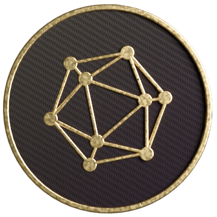
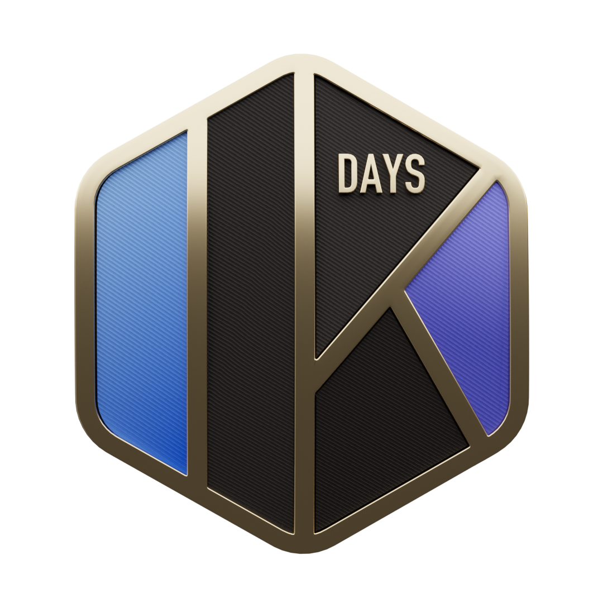
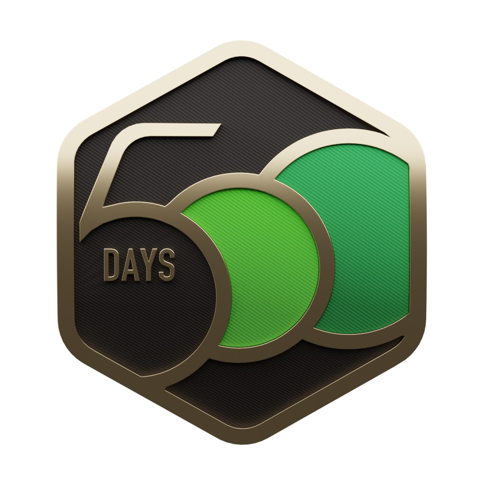
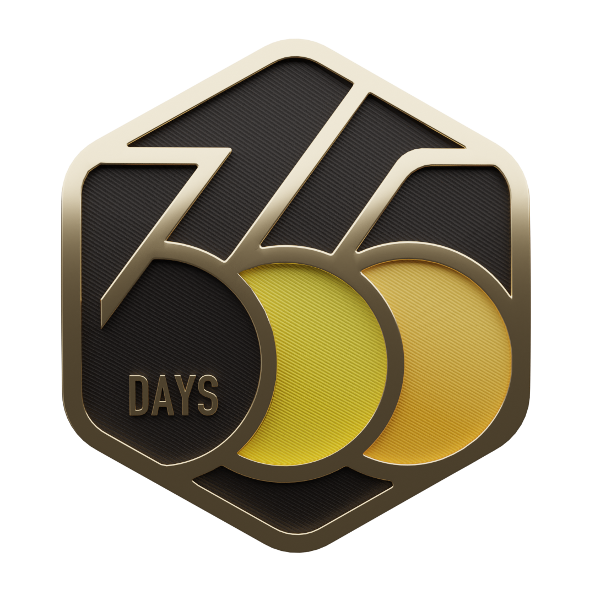
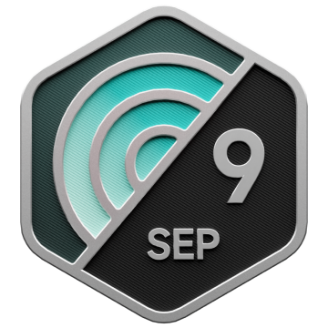

# Selos do LeetCode

Esta seção apresentará todos os selos conquistados no LeetCode. Cada Selo representa um marco na jornada de resolução de problemas e domínio de algoritmos. Você pode acompanhar o progresso e conquistas em várias categorias como níveis de dificuldade, consistência na resolução de problemas e contribuições para a comunidade.

_Agradecimentos especiais ao [LeetCode-Badges](https://github.com/ChinemeremChigbo/LeetCode-Badges) por [Chinemerem](https://github.com/ChinemeremChigbo) por publicar os Selos e tornar possível incluí-los aqui._

 

<table>
  <tr>
    <th>Selo</th>
    <th>Nome</th>
    <th>Como Ganhar</th>
    <th>Tipo</th>
    <th>Conquistável</th>
  </tr>
  <tr>
    <td align="center"></td>
    <td align="center">Guardião</td>
    <td align="center">Ter uma Classificação de Competição >=1600 e terminar entre os 5% melhores de uma competição</td>
    <td align="center">Medalhas de Competição</td>
    <td align="center">✅</td>
  </tr>
  <tr>
    <td align="center"></td>
    <td align="center">Cavaleiro</td>
    <td align="center">Ter uma Classificação de Competição >=1600 e terminar entre os 25% melhores de uma competição</td>
    <td align="center">Medalhas de Competição</td>
    <td align="center">✅</td>
  </tr>
  <tr>
    <td align="center"></td>
    <td align="center">Selo Abr 2025</td>
    <td align="center">Enviar código diariamente em abril de 2025</td>
    <td align="center">Medalhas Diárias</td>
    <td align="center">✅</td>
  </tr>
  <tr>
    <td align="center"></td>
    <td align="center">Introdução ao Pandas</td>
    <td align="center">Completar o plano de estudos "Introdução ao Pandas"</td>
    <td align="center">Medalhas de Plano de Estudos</td>
    <td align="center">✅</td>
  </tr>
  <tr>
    <td align="center"></td>
    <td align="center">30 Dias de Pandas</td>
    <td align="center">Completar o plano de estudos "30 Dias de Pandas"</td>
    <td align="center">Medalhas de Plano de Estudos</td>
    <td align="center">✅</td>
  </tr>
  <tr>
    <td align="center"></td>
    <td align="center">30 Dias de JavaScript</td>
    <td align="center">Completar o plano de estudos "30 Dias de JavaScript"</td>
    <td align="center">Medalhas de Plano de Estudos</td>
    <td align="center">✅</td>
  </tr>
  <tr>
    <td align="center"></td>
    <td align="center">Top Entrevista 150</td>
    <td align="center">Completar o plano de estudos "Top Entrevista 150"</td>
    <td align="center">Medalhas de Plano de Estudos</td>
    <td align="center">✅</td>
  </tr>
  <tr>
    <td align="center"></td>
    <td align="center">LeetCode 75</td>
    <td align="center">Completar o plano de estudos "LeetCode 75"</td>
    <td align="center">Medalhas de Plano de Estudos</td>
    <td align="center">✅</td>
  </tr>
  <tr>
    <td align="center"></td>
    <td align="center">Top 100 Curtidos</td>
    <td align="center">Completar o plano de estudos "Top 100 Curtidos"</td>
    <td align="center">Medalhas de Plano de Estudos</td>
    <td align="center">✅</td>
  </tr>
  <tr>
    <td align="center"></td>
    <td align="center">SQL 50</td>
    <td align="center">Completar o plano de estudos "SQL 50"</td>
    <td align="center">Medalhas de Plano de Estudos</td>
    <td align="center">✅</td>
  </tr>
  <tr>
    <td align="center"></td>
    <td align="center">Premium Algo 100</td>
    <td align="center">Completar o plano de estudos "Premium Algo 100"</td>
    <td align="center">Medalhas de Plano de Estudos</td>
    <td align="center">✅</td>
  </tr>
  <tr>
    <td align="center"></td>
    <td align="center">SQL Avançado 50</td>
    <td align="center">Completar o plano de estudos "SQL Avançado 50"</td>
    <td align="center">Medalhas de Plano de Estudos</td>
    <td align="center">✅</td>
  </tr>
  <tr>
    <td align="center"></td>
    <td align="center">Habilidades de Programação</td>
    <td align="center">Completar o plano de estudos "Habilidades de Programação"</td>
    <td align="center">Medalhas de Plano de Estudos</td>
    <td align="center">✅</td>
  </tr>
  <tr>
    <td align="center"></td>
    <td align="center">Programação Dinâmica</td>
    <td align="center">Completar o plano de estudos "Programação Dinâmica"</td>
    <td align="center">Medalhas de Plano de Estudos</td>
    <td align="center">✅</td>
  </tr>
  <tr>
    <td align="center"></td>
    <td align="center">Grande Mestre em Programação Dinâmica</td>
    <td align="center">Completar o plano de estudos "Grande Mestre em Programação Dinâmica"</td>
    <td align="center">Medalhas de Plano de Estudos</td>
    <td align="center">✅</td>
  </tr>
  <tr>
    <td align="center"></td>
    <td align="center">Teoria dos Grafos</td>
    <td align="center">Completar o plano de estudos "Teoria dos Grafos"</td>
    <td align="center">Medalhas de Plano de Estudos</td>
    <td align="center">✅</td>
  </tr>
  <tr>
    <td align="center"></td>
    <td align="center">Busca Binária</td>
    <td align="center">Completar o plano de estudos "Busca Binária"</td>
    <td align="center">Medalhas de Plano de Estudos</td>
    <td align="center">✅</td>
  </tr>
  <tr>
    <td align="center"></td>
    <td align="center">Selo 2000 Dias</td>
    <td align="center">Enviar código em mais de 2000 dias distintos</td>
    <td align="center">Dias de Submissão</td>
    <td align="center">✅</td>
  </tr>
  <tr>
    <td align="center"></td>
    <td align="center">Selo 1000 Dias</td>
    <td align="center">Enviar código em mais de 1000 dias distintos</td>
    <td align="center">Dias de Submissão</td>
    <td align="center">✅</td>
  </tr>
  <tr>
    <td align="center"></td>
    <td align="center">Selo 500 Dias</td>
    <td align="center">Enviar código em mais de 500 dias distintos</td>
    <td align="center">Dias de Submissão</td>
    <td align="center">✅</td>
  </tr>
  <tr>
    <td align="center"></td>
    <td align="center">Selo 365 Dias</td>
    <td align="center">Enviar código em mais de 365 dias distintos</td>
    <td align="center">Dias de Submissão</td>
    <td align="center">✅</td>
  </tr>
  <tr>
    <td align="center"></td>
    <td align="center">Selo Anual 2024</td>
    <td align="center">Enviar código em mais de 300 dias distintos em 2024</td>
    <td align="center">Medalhas Anuais</td>
    <td align="center">❌</td>
  </tr>
  <tr>
    <td align="center"></td>
    <td align="center">Selo 200 Dias 2024</td>
    <td align="center">Enviar código em mais de 200 dias distintos em 2024</td>
    <td align="center">Medalhas Anuais</td>
    <td align="center">❌</td>
  </tr>
  <tr>
    <td align="center"></td>
    <td align="center">Selo 100 Dias 2024</td>
    <td align="center">Enviar código em mais de 100 dias distintos em 2024</td>
    <td align="center">Medalhas Anuais</td>
    <td align="center">❌</td>
  </tr>
  <tr>
    <td align="center"></td>
    <td align="center">Selo 50 Dias 2024</td>
    <td align="center">Enviar código em mais de 50 dias distintos em 2024</td>
    <td align="center">Medalhas Anuais</td>
    <td align="center">❌</td>
  </tr>
  <tr>
    <td align="center"></td>
    <td align="center">Selo Anual 2023</td>
    <td align="center">Enviar código em mais de 300 dias distintos em 2023</td>
    <td align="center">Medalhas Anuais</td>
    <td align="center">❌</td>
  </tr>
  <tr>
    <td align="center"></td>
    <td align="center">Selo 100 Dias 2023</td>
    <td align="center">Enviar código em mais de 100 dias distintos em 2023</td>
    <td align="center">Medalhas Anuais</td>
    <td align="center">❌</td>
  </tr>
  <tr>
    <td align="center"></td>
    <td align="center">Selo 50 Dias 2023</td>
    <td align="center">Enviar código em mais de 50 dias distintos em 2023</td>
    <td align="center">Medalhas Anuais</td>
    <td align="center">❌</td>
  </tr>
  <tr>
    <td align="center"></td>
    <td align="center">Selo Anual 2022</td>
    <td align="center">Enviar código em mais de 300 dias distintos em 2022</td>
    <td align="center">Medalhas Anuais</td>
    <td align="center">❌</td>
  </tr>
  <tr>
    <td align="center"></td>
    <td align="center">Medalha Anual 2021</td>
    <td align="center">Enviar código em mais de 300 dias distintos em 2021</td>
    <td align="center">Medalhas Anuais</td>
    <td align="center">❌</td>
  </tr>
  <tr>
    <td align="center"></td>
    <td align="center">Selo Jan 2025</td>
    <td align="center">Enviar código diariamente em janeiro de 2025</td>
    <td align="center">Medalhas Diárias</td>
    <td align="center">❌</td>
  </tr>
  <tr>
    <td align="center"></td>
    <td align="center">Selo Fev 2025</td>
    <td align="center">Enviar código diariamente em fevereiro de 2025</td>
    <td align="center">Medalhas Diárias</td>
    <td align="center">❌</td>
  </tr>
  <tr>
    <td align="center"></td>
    <td align="center">Selo Mar 2025</td>
    <td align="center">Enviar código diariamente em março de 2025</td>
    <td align="center">Medalhas Diárias</td>
    <td align="center">❌</td>
  </tr>
  <tr>
    <td align="center"></td>
    <td align="center">Selo Mai 2025</td>
    <td align="center">Enviar código diariamente em maio de 2025</td>
    <td align="center">Medalhas Diárias</td>
    <td align="center">❌</td>
  </tr>
  <tr>
    <td align="center"></td>
    <td align="center">Selo Jun 2025</td>
    <td align="center">Enviar código diariamente em junho de 2025</td>
    <td align="center">Medalhas Diárias</td>
    <td align="center">❌</td>
  </tr>
  <tr>
    <td align="center"></td>
    <td align="center">Selo Jul 2025</td>
    <td align="center">Enviar código diariamente em julho de 2025</td>
    <td align="center">Medalhas Diárias</td>
    <td align="center">❌</td>
  </tr>
  <tr>
    <td align="center"></td>
    <td align="center">Selo Ago 2025</td>
    <td align="center">Enviar código diariamente em agosto de 2025</td>
    <td align="center">Medalhas Diárias</td>
    <td align="center">❌</td>
  </tr>
  <tr>
    <td align="center"></td>
    <td align="center">Selo Set 2025</td>
    <td align="center">Enviar código diariamente em setembro de 2025</td>
    <td align="center">Medalhas Diárias</td>
    <td align="center">❌</td>
  </tr>
  <tr>
    <td align="center"></td>
    <td align="center">Selo Out 2025</td>
    <td align="center">Enviar código diariamente em outubro de 2025</td>
    <td align="center">Medalhas Diárias</td>
    <td align="center">❌</td>
  </tr>
  <tr>
    <td align="center"></td>
    <td align="center">Selo Dez 2025</td>
    <td align="center">Enviar código diariamente em dezembro de 2025</td>
    <td align="center">Medalhas Diárias</td>
    <td align="center">❌</td>
  </tr>
  <tr>
    <td align="center"></td>
    <td align="center">Selo Jan 2024</td>
    <td align="center">Enviar código diariamente em janeiro de 2024</td>
    <td align="center">Medalhas Diárias</td>
    <td align="center">❌</td>
  </tr>
  <tr>
    <td align="center"></td>
    <td align="center">Selo Fev 2024</td>
    <td align="center">Enviar código diariamente em fevereiro de 2024</td>
    <td align="center">Medalhas Diárias</td>
    <td align="center">❌</td>
  </tr>
  <tr>
    <td align="center"></td>
    <td align="center">Selo Mar 2024</td>
    <td align="center">Enviar código diariamente em março de 2024</td>
    <td align="center">Medalhas Diárias</td>
    <td align="center">❌</td>
  </tr>
  <tr>
    <td align="center"></td>
    <td align="center">Selo Abr 2024</td>
    <td align="center">Enviar código diariamente em abril de 2024</td>
    <td align="center">Medalhas Diárias</td>
    <td align="center">❌</td>
  </tr>
  <tr>
    <td align="center"></td>
    <td align="center">Selo Mai 2024</td>
    <td align="center">Enviar código diariamente em maio de 2024</td>
    <td align="center">Medalhas Diárias</td>
    <td align="center">❌</td>
  </tr>
  <tr>
    <td align="center"></td>
    <td align="center">Selo Jun 2024</td>
    <td align="center">Enviar código diariamente em junho de 2024</td>
    <td align="center">Medalhas Diárias</td>
    <td align="center">❌</td>
  </tr>
  <tr>
    <td align="center"></td>
    <td align="center">Selo Jul 2024</td>
    <td align="center">Enviar código diariamente em julho de 2024</td>
    <td align="center">Medalhas Diárias</td>
    <td align="center">❌</td>
  </tr>
  <tr>
    <td align="center"></td>
    <td align="center">Selo Ago 2024</td>
    <td align="center">Enviar código diariamente em agosto de 2024</td>
    <td align="center">Medalhas Diárias</td>
    <td align="center">❌</td>
  </tr>
  <tr>
    <td align="center"></td>
    <td align="center">Selo Set 2024</td>
    <td align="center">Enviar código diariamente em setembro de 2024</td>
    <td align="center">Medalhas Diárias</td>
    <td align="center">❌</td>
  </tr>
  <tr>
    <td align="center"></td>
    <td align="center">Selo Out 2024</td>
    <td align="center">Enviar código diariamente em outubro de 2024</td>
    <td align="center">Medalhas Diárias</td>
    <td align="center">❌</td>
  </tr>
  <tr>
    <td align="center"></td>
    <td align="center">Selo Dez 2024</td>
    <td align="center">Enviar código diariamente em dezembro de 2024</td>
    <td align="center">Medalhas Diárias</td>
    <td align="center">❌</td>
  </tr>
  <tr>
    <td align="center"></td>
    <td align="center">Selo Nov 2024</td>
    <td align="center">Enviar código diariamente em novembro de 2024</td>
    <td align="center">Medalhas Diárias</td>
    <td align="center">❌</td>
  </tr>
    <tr>
    <td align="center"></td>
    <td align="center">Selo Jan 2023</td>
    <td align="center">Enviar código diariamente em janeiro de 2023</td>
    <td align="center">Medalhas Diárias</td>
    <td align="center">❌</td>
  </tr>
  <tr>
    <td align="center"></td>
    <td align="center">Selo Fev 2023</td>
    <td align="center">Enviar código diariamente em fevereiro de 2023</td>
    <td align="center">Medalhas Diárias</td>
    <td align="center">❌</td>
  </tr>
  <tr>
    <td align="center"></td>
    <td align="center">Selo Mar 2023</td>
    <td align="center">Enviar código diariamente em março de 2023</td>
    <td align="center">Medalhas Diárias</td>
    <td align="center">❌</td>
  </tr>
  <tr>
    <td align="center"></td>
    <td align="center">Selo Abr 2023</td>
    <td align="center">Enviar código diariamente em abril de 2023</td>
    <td align="center">Medalhas Diárias</td>
    <td align="center">❌</td>
  </tr>
  <tr>
    <td align="center"></td>
    <td align="center">Selo Mai 2023</td>
    <td align="center">Enviar código diariamente em maio de 2023</td>
    <td align="center">Medalhas Diárias</td>
    <td align="center">❌</td>
  </tr>
  <tr>
    <td align="center"></td>
    <td align="center">Selo Jun 2023</td>
    <td align="center">Enviar código diariamente em junho de 2023</td>
    <td align="center">Medalhas Diárias</td>
    <td align="center">❌</td>
  </tr>
  <tr>
    <td align="center"></td>
    <td align="center">Selo Jul 2023</td>
    <td align="center">Enviar código diariamente em julho de 2023</td>
    <td align="center">Medalhas Diárias</td>
    <td align="center">❌</td>
  </tr>
  <tr>
    <td align="center"></td>
    <td align="center">Selo Ago 2023</td>
    <td align="center">Enviar código diariamente em agosto de 2023</td>
    <td align="center">Medalhas Diárias</td>
    <td align="center">❌</td>
  </tr>
  <tr>
    <td align="center"></td>
    <td align="center">Selo Set 2023</td>
    <td align="center">Enviar código diariamente em setembro de 2023</td>
    <td align="center">Medalhas Diárias</td>
    <td align="center">❌</td>
  </tr>
  <tr>
    <td align="center"></td>
    <td align="center">Selo Out 2023</td>
    <td align="center">Enviar código diariamente em outubro de 2023</td>
    <td align="center">Medalhas Diárias</td>
    <td align="center">❌</td>
  </tr>
  <tr>
    <td align="center"></td>
    <td align="center">Selo Nov 2023</td>
    <td align="center">Enviar código diariamente em novembro de 2023</td>
    <td align="center">Medalhas Diárias</td>
    <td align="center">❌</td>
  </tr>
